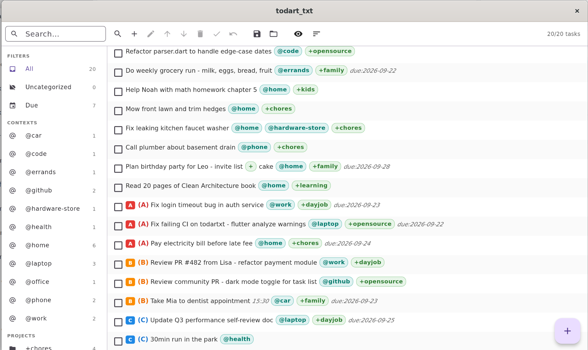

# ToDartTxt — plain-text `todo.txt`

[](https://github.com/galets/todartxt/releases)
[](./linux)
[](./LICENSE)
[](http://todotxt.org)



A Flutter UI for [todo.txt](http://todotxt.org/). Your tasks stay in one plain-text
`todo.txt` — no database, no lock-in, fully greppable and git-friendly.

Runs on **Android + Linux**. On Android, open your file via the System file picker
(SAF `DocumentsProvider`), so cloud providers such as **ownCloud / Nextcloud**,
Google Drive, or local storage all work through the same path. On Linux it is a
plain file: CLI arg → remembered dir → `~/Tasks/todo.txt`.

Edit `~/.config/todartxt.yaml` for alternative file location.
For live sync via a [gatefile](https://github.com/galets/gatefile) server:

```yaml
todo_file: gatefile://127.0.0.1:8654/gatefile/todo.txt  # or gatefiles:// for HTTPS
api_key: <shared secret>
```

See `doc/GATEFILE.md` for the backend design.

## Key Features

* **Full todo.txt syntax** — priorities `(A)-(Z)`, `x` completed + dates,
  `@context`, `+project`, `key:value` incl. `due:YYYY-MM-DD`.
* **Single-window task UI** — toolbar (Search, Add/Edit/Delete/Complete,
  Priority +/-, Undo, Save, Storage, View, Sort, counter), sidebar filters
  (`All / Due / Contexts / Projects / Priorities / Complete`),
  rich rows (priority badge, tappable `@`/`+` pills, strikethrough done).
* **Filter, search, sort** — live substring search + sidebar; sort by
  `priority (default) / date / project`, completed-last toggle.
* **Safe local storage** — atomic tmp+rename writes, symlink-preserving,
  autosave on pause/hide, manual `Ctrl+S`, undo history, sample `todo.txt` included.
* **Android SAF backend** — `ACTION_OPEN_DOCUMENT` picker, URI persisted in
  `SharedPreferences`, works with ownCloud/Nextcloud, Drive, local files.

## Quick Start

```sh
# Linux desktop
flutter run -d linux -- todo.txt
flutter build linux

# Android (device or emulator)
flutter run -d android
flutter build apk --release
```

Pick storage: **Storage location** button → file picker (Android) or path
(Linux). File is remembered across restarts.

Sample `todo.txt`:

```txt
(A) Call Alice @phone +family due:2026-09-22
(B) Fix login bug +dayjob @work due:2026-09-23
x 2026-09-20 Buy milk +chores @errands
```

## Docs

* `doc/USER-interface.md` — UI spec
* `doc/SPECS.md` — platform + logging spec
* `doc/STORAGE-access-framework.md` — SAF / ownCloud design
* `doc/ANDROID.md`, `doc/BUILD.md` — build notes

## License

See [LICENSE](./LICENSE).
